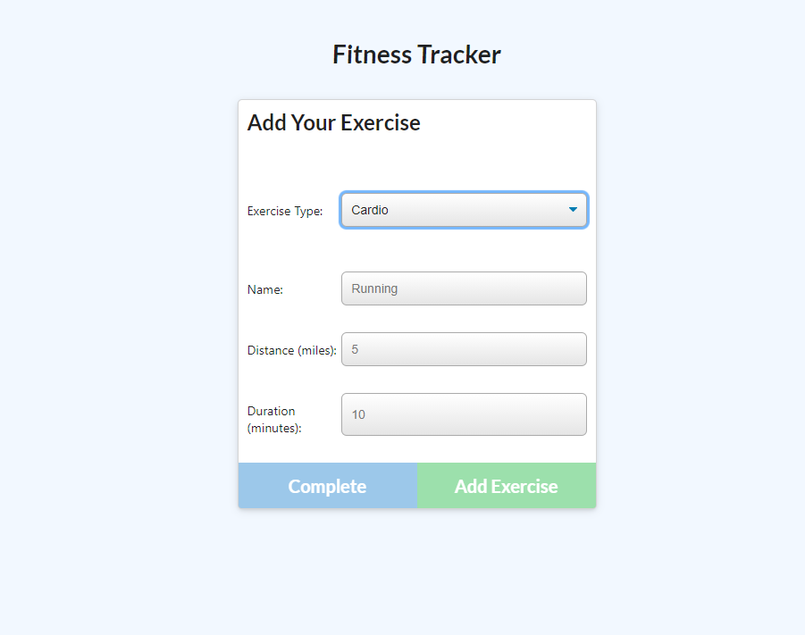

# Workout Tracker
  
  
  
  ### Description

  This application is a Workout Tracker using a Nosql database. Its designed to allow users to keep track of daily workouts and their progress. The user can log multiple exercises in a workout everyday. When the user loads the page, they should be given the option to create a new workout, or continue with their last workout.

  The user should be able to:

  * Add exercises to a previous workout plan.

  * Add new exercises to a new workout plan.

  * View multiple the combined weight of multiple exercises on the `stats` page.

  ### User Story

  * As a user, I want to be able to view create and track daily workouts. I want to be able to log multiple exercises in a workout on a given day. I should also be able to track the name, type, weight, sets, reps, and duration of exercise. If the exercise is a cardio exercise, I should be able to track my distance traveled.
  
  ### Table of Contents

  * [Installation](#installation)
  * [Usage](#usage)
  * [Contributors](#contributors)
  * [License](#license)
  * [Repository](#Repository)
  * [Questions](#questions)

  ### Installation

  Installation not necessary. App deployed on Heroku.

  ### Usage

  * Open the App.
  * Click on new workout or continue a workout.
  * Fill out information on Add Your Exercise.
  * Select to "Add Exercise" or "Complete".
  * Click On top right "Dashboard Button" for detailed information about exercise stats and information. 

  ### App Screen Shots

  
  
  
  
  
  ### Contributors

  

  ### License

  

  ### Repository

  - [Github]()
  - [Heroku]()

  ### Questions

  If you have any additional questions you may contact me at https://github.com/EMackPierre

  You may also email me at emmp318@gmail.com